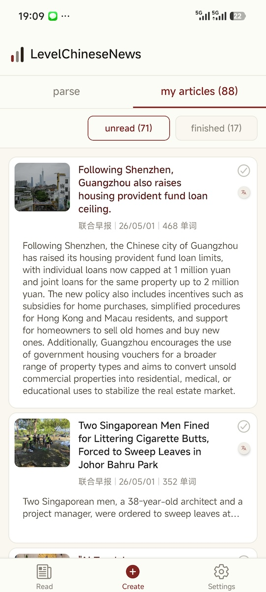
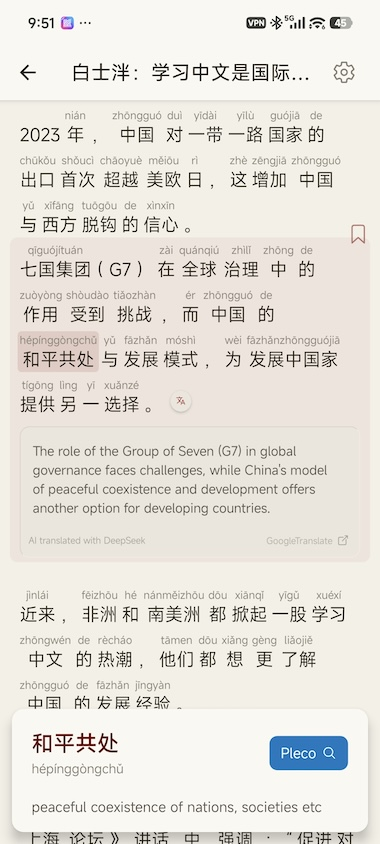
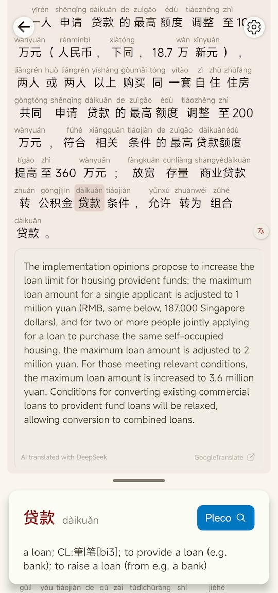
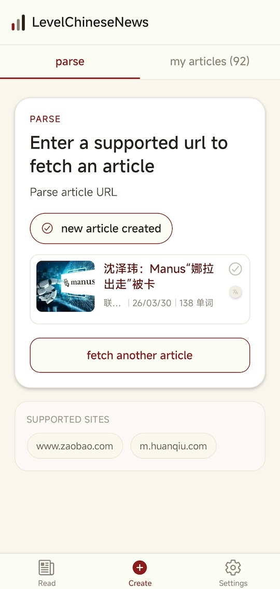

# LevelChinese News

This repo contains the Android, Web, and iOS (not released) app for LevelChinese, that makes native Chinese news and other native content more approachable for Chinese learners by building a set of tools to bridge the gap between intermediate learners and native content.

**Website:** [levelchinese.app](https://levelchinese.app) — screenshots, download links, and more about the project.

## Features

**Reading**

- Pinyin and word segmentation (toggle on/off)
- Tap any word for definitions from an offline CEDICT dictionary (~115k entries)
- Pleco integration — open lookups in the Pleco app when you need more depth
- Sentence-level translations in your native language (English, Spanish, Malay, Indonesian, Vietnamese, Russian, Arabic, or Chinese)
- Sentence bookmarks — resume long articles exactly where you left off
- Dark mode, adjustable font size, line spacing, and optional Noto Sans SC

**Library & discovery**

- Daily news feed from real sources (e.g. Zaobao, Huanqiu, ThePapenCN, ZhihuQA)
- Parse a news URL to read it in the app
- My Articles with English or localized titles and summaries
- Filter by topic tags; sort by published date or date added
- Saved articles and reading progress stored on your device (offline-first)

**App**

- Settings and UI in 8 languages, matched to your chosen native language

### Android version

| | | |
| :---: | :---: | :---: |
| **News feed** — browse fresh articles added daily. | **My articles** — English titles and summaries so you know what to read next. | **Article reader** — read with pinyin, word segmentation, and popup dictionary. |
|  |  |  |
| **Translate** — tap any sentence for an instant translation. | **Parse article** — add a news URL you want to read in the app. | |
|  |  | |


## In development

- Support learned and words list, but first Anki integration
- More sources (create an issue to add a article source)
- Support per sentence Chinese audio
- Add more easier content sources, need to find free library for graded readers, intermediate stories
- Improve reading experience, more Chinese fonts

### Note on iOS and Web

The web version has been split into it's own branch and will diverge from the mobile apps. The iOS has not been tested and probably broken. If you are an iOS dev, any bug fixes with iOS is appreciatiated.

## Tech Stack

- [Expo](https://expo.dev) with [expo-router](https://docs.expo.dev/router/introduction/)
- React Native (iOS, Android, Web)
- TypeScript

## Getting Started

```bash
pnpm install
pnpm start
```

Then choose iOS, Android, or Web from the Expo dev tools.

## Contributing

Contributions are welcome, but I need to spend some time prioritising what features we want to develop. The areas where help is most needed right now:

### UI translations

The app UI is available in 8 languages (see `lib/i18n/translations.ts`). We need native or fluent speakers to review and improve strings so labels, buttons, and messages read naturally—not like machine translation. If you use the app in Spanish, Malay, Indonesian, Vietnamese, Russian, Arabic, or Chinese, pull requests that fix awkward or incorrect copy are especially valuable.

### Native-language enhancements

We are looking for volunteers to design and build **language-specific features** beyond the shared Chinese reader—for example, **local dictionaries** tailored to learners whose native language is **Arabic**, **Indonesian**, or **Russian**. If you have ideas, dictionary data, or integration experience for your language community, open an [issue](https://github.com/zshanhui/levelchinesenews-mobile-apps/issues) or start a discussion before a large change. Your native language should be the language you want to build the feature for.

### How to contribute

1. Fork the repo and open a pull request with a clear description of what you changed and why.
2. For translation-only updates, mention your language proficiency and send me an email to to discuss what we need help with.

Questions or coordination: [shanhui@proton.me](mailto:shanhui@proton.me).

## API

All API hosts are configured via `.env` (`EXPO_PUBLIC_API_URL`, `EXPO_PUBLIC_API_WRITE_URL`). Paths use the `/api/v1` prefix (see `lib/api.ts` and `lib/constants.ts`).

## Backend Service

The backend is not ready to be opensourced yet, but will be eventually. The security needs to be improved along with other things especially due to the rise of AI tools in security research. If you would like to run this app, you can email me shanhui@proton.me for url and credentials to a development server
